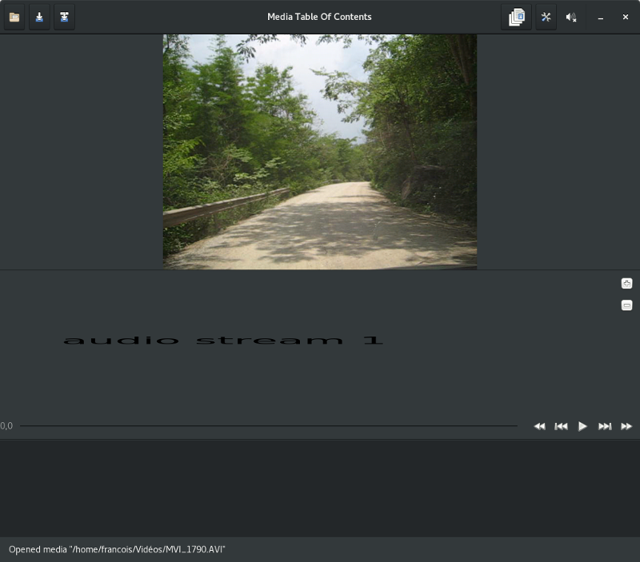

# Media-TOC
Media-TOC is an application to build a table of contents from of a media file or
to split a media file into chapters.

**Important**: Media-TOC is in a very early stage of development. Don't expect
anything usable anytime soon. Of course, you can [contribute](#contribute) to the project
if you find it interesting.

# Design
## Technologies
Media-TOC is developped in Rust. This is my first project using this language.
Current design is merely a [UI prototype](#ui) and a set of technologies:
- **GTK-3** ([official documentation](https://developer.gnome.org/gtk3/stable/),
[Rust binding](https://crates.io/crates/gtk)) and [Glade](https://glade.gnome.org/).
- **Cairo** ([official documentation](https://www.cairographics.org/documentation/),
[Rust binding](https://crates.io/crates/cairo-rs)).
- **FFMPEG** ([official documentation](https://ffmpeg.org/documentation.html),
[Rust binding](https://crates.io/crates/ffmpeg)).

## <a name='ui'></a>UI prototype


# <a name='contribute'></a>How to contribute
Contributions are welcomed.
- For a design or feature proposal or a bug report, you can [declare an issue](https://github.com/fengalin/media-toc/issues).
- If you wish to contribute to the code, please fork your own copy and submit a
[pull request](https://github.com/fengalin/media-toc/pulls).

# Environment preparation
## Toolchain
You can install Rust via your package manager or using Rustup which allows
installing the compiler for your user only and which will fetch the latest
versions (stable or nightly, depending on your preferences).

### Using the distribution's package manager
Example on Fedora:
```
sudo dnf install rust cargo
```

### Using rustup
```
curl https://sh.rustup.rs -sSf | sh
```
See the full documentation [here](https://github.com/rust-lang-nursery/rustup.rs#installation).

## Dependencies
Dependencies are handled by [Cargo](http://doc.crates.io/). You will need the
following packages installed on your OS:

### Fedora
```
$ sudo dnf install gtk3-devel glib2-devel
```

### Debian & Unbuntu
```
$ sudo apt-get install libgtk-3-dev
```

### OS X
```
$ brew install gtk+3
```

### Windows
See [this page](http://gtk-rs.org/docs/requirements.html).

# Build and run
Use Cargo (from the root of the project directory):
```
$ cargo run
```

