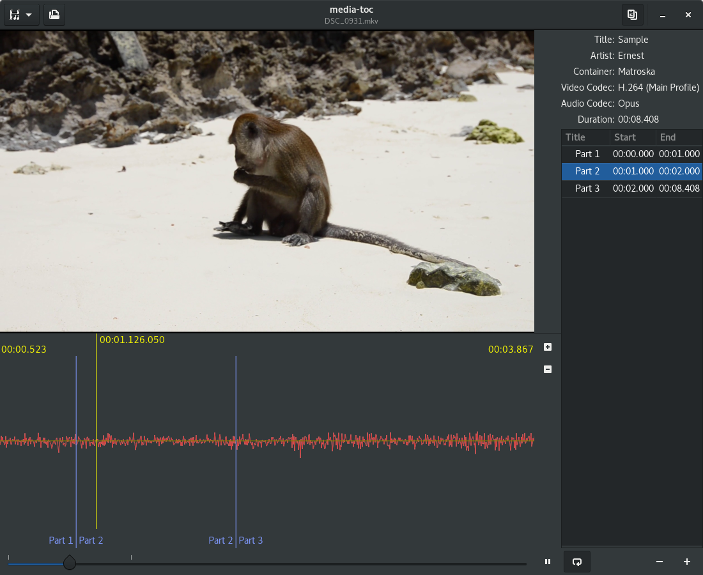
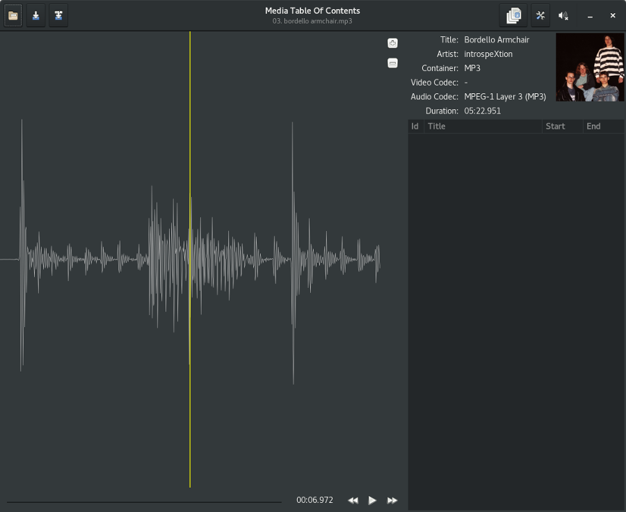
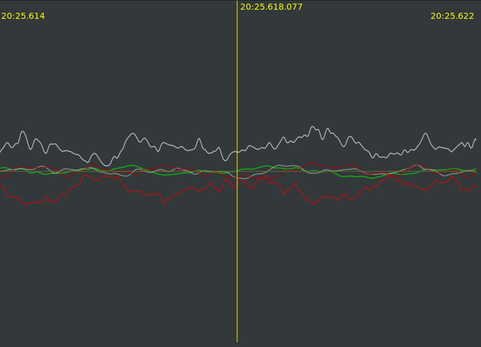

# media-toc [](https://travis-ci.org/fengalin/media-toc) [](https://ci.appveyor.com/project/fengalin/media-toc)
**media-toc** is an application to build a table of contents from a media file or
to split a media file into chapters. It is primarily developed in Rust on Linux,
it runs on Windows and should also work on macOS.

**media-toc** is not fully functional yet, see the [Status section](#status) below.
Of course, you can contribute to the project if you find it interesting.

## <a name='ui'></a>Screenshots
### UI with a video file


### UI with an audio file


### Waveform showing 5.1 audio channels


## <a name='status'></a>Status
At the moment, **media-toc** can:

- Open a media file: display metadata from the media, the cover image, the first
video frame, the chapters list and marks at the beginning of each chapter on the
timeline.
- Play/Pause the audio and video, draw the audio waveform and select current
chapter in the list while playing.
- Seek in the media by clicking on the waveform, on the timeline or in the
chapters list.
- Zoom in/out the waveform on the time axis.
- Add/remove a chapter.
- Export the table of contents to:
	* [mkvmerge simple chapter format](https://mkvtoolnix.download/doc/mkvmerge.html#mkvmerge.chapters).
	* [Cue Sheet](http://wiki.hydrogenaud.io/index.php?title=Cue_sheet).
- Import the table of contents from:
	* mkv containers.
	* [mkvmerge simple chapter format](https://mkvtoolnix.download/doc/mkvmerge.html#mkvmerge.chapters).

# Howto

## Add a table of contents to an mkv media

**media-toc** doesn't export to mkv yet. However, the following workflow will provide you
with a solution to define a table of contents using *media-toc* and to use [mkvmerge](https://mkvtoolnix.download/doc/mkvmerge.html)
to add the chapters to a mkv media.

### Build media-toc

Until I add a flatpack package, you will have to generate **media-toc** from source.
Follow the instructions [here](#generation).

### Install mkvtoolnix

**mkvmerge** is part of **mkvtoolnix**. Use your package manager to install it.

On Fedora, use the following command:
```
sudo dnf install mkvtoolnix
```

### Run media-toc

Go to the root of the project and issue the following command:
```
$ cargo run --release
```

### Create the table of contents

Remember that this howto is about adding a table of contents to an existing mkv media.

1. Click on the folder icon or the play icon to open the file selection dialog.
2. Select the mkv media for which you want to add a table of contents.
3. If you want to add a chapter starting at the begining of the file, you can click on the `+` icon
under the tree view at the bottom right of the window. The end of the chapter will match the end
of the media. This will change automatically if you add new chapters.
4. Click in the newly added chapter title column and fill the title for this chapter.
5. Play the stream until the next chapter's starting position. You can use the timeline to seek
in the media.
6. In order to precisely define the start of the new chapter, pause the media by clicking on the
play/pause button, then use the `+` button next to the waveform to zoom in. You can then seek around
current sample by clicking on the waveform.
7. When the cursor (the vertical yellow bar) matches the start of the chapter to add, click on the
`+` icon under the tree view at the bottom right of the window.
8. Click in the newly added chapter title column and fill a title for this chapter.
9. Go back to step 5 if you wish to add another chapter.
10. Click on the export button (the "multiple documents" icon) on the right side of the header bar.
11. Click the `export` button. A new file with the same name as your media and a `txt` extension
will be created in the media's folder.

### Create a new media with the table of contents

1. Open a terminal and `cd` to the directory where your mkv file is located.
2. Issue the following command (where _media_ is the name of your mkv file without the extension):
    ```
    mkvmerge --chapters _media_.txt -o output_file.mkv _media_.mkv
    ```

The file `output_file.mkv` will now contain the media with the chapters you defined.

# Technologies
**media-toc** is developed in Rust and uses the following technologies:
- **GTK-3** ([official documentation](https://developer.gnome.org/gtk3/stable/),
[Rust binding](http://gtk-rs.org/docs/gtk/)) and [Glade](https://glade.gnome.org/).
- **Cairo** ([official documentation](https://www.cairographics.org/documentation/),
[Rust binding](http://gtk-rs.org/docs/cairo/index.html)).
- **GStreamer** ([official documentation](https://gstreamer.freedesktop.org/documentation/),
[Rust binding](https://sdroege.github.io/rustdoc/gstreamer/gstreamer/)).

# <a name='generation'></a>Generation
## Toolchain
Rust nightly version is required at the moment.
```
$ curl https://sh.rustup.rs -sSf | sh
```
Select the nightly toolchain. See the full documentation
[here](https://github.com/rust-lang-nursery/rustup.rs#installation).

## Dependencies
Rust dependencies are handled by [Cargo](http://doc.crates.io/). You will also
need the following packages installed on your OS:

### Fedora
```
sudo dnf install gtk3-devel glib2-devel gstreamer1-devel \
	gstreamer1-plugins-base-devel gstreamer1-plugins-good \
	gstreamer1-plugins-bad-free gstreamer1-plugins-ugly-free \
	gstreamer1-libav
```

### Debian & Unbuntu
```
sudo apt-get install libgtk-3-dev libgstreamer1.0-dev \
	libgstreamer-plugins-base1.0-dev gstreamer1.0-plugins-good \
	gstreamer1.0-plugins-bad gstreamer1.0-plugins-ugly \
	gstreamer1.0-libav
```

### macOS
*Needs confirmation*
```
brew install gtk+3 gstreamer gst-plugins-base gst-plugins-good \
	gst-plugins-bad gst-plugins-ugly gst-libav
```

### Windows
- MSYS2: follow [this guide](http://www.msys2.org/).
- Install the development toolchain, GTK and GStreamer<br>
Note: for a 32bits system, use `mingw-w64-i686-...`
```
pacman --noconfirm -S mingw-w64-x86_64-gtk3 \
	mingw-w64-x86_64-gstreamer mingw-w64-x86_64-gst-plugins-base \
	mingw-w64-x86_64-gst-plugins-good mingw-w64-x86_64-gst-plugins-bad \
	mingw-w64-x86_64-gst-plugins-ugly mingw-w64-x86_64-gst-libav
```

- Launch the [rustup installer](https://www.rustup.rs/).
When asked for the default host triple, select `x86_64-pc-windows-gnu` (or
`i686-pc-windows-gnu` for a 32bits system), then select `nightly`.
- From a MSYS2 mingw shell
  - add cargo to the `PATH`:
  ```
  echo 'PATH=$PATH:/c/Users/'$USER'/.cargo/bin' >> /c/Users/'$USER'/.bashrc
  ```
  - Restart the MSYS2 shell before using `cargo`.

# Build and run
Use Cargo (from the root of the project directory):
```
$ cargo run --release
```
