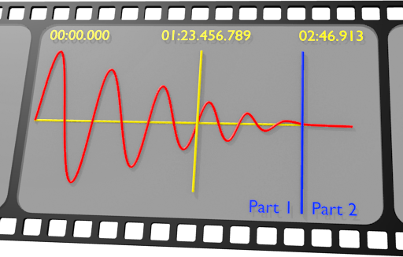
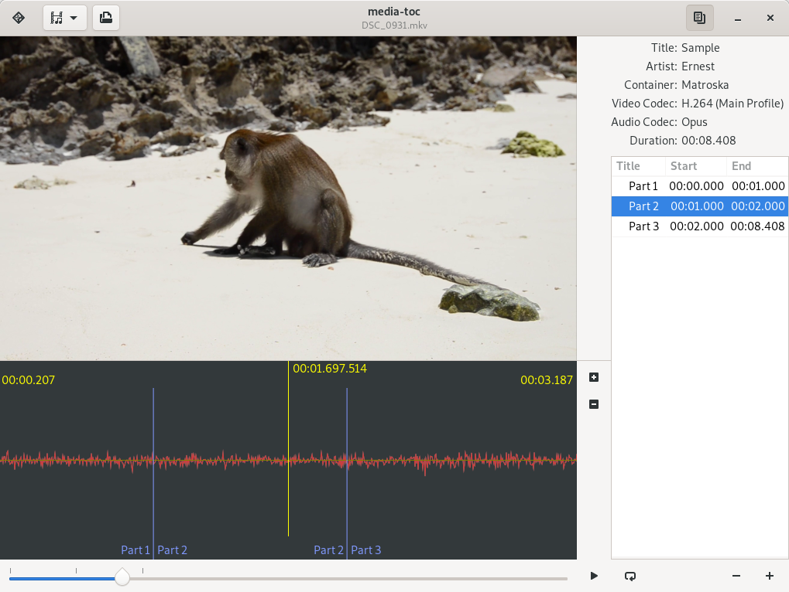
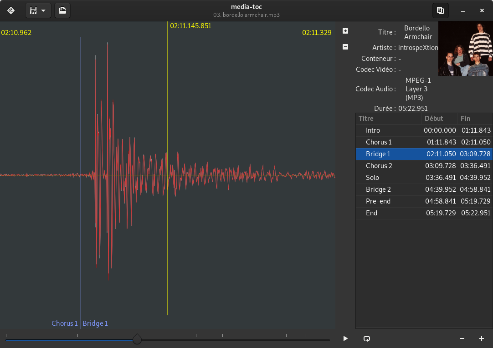

# media-toc  [](https://deps.rs/repo/github/fengalin/media-toc)



**media-toc** is an application to build a table of contents from a media file or to split a media
file into chapters.

You might also be interested in [media-toc-player](https://github.com/fengalin/media-toc-player):
a media player with a table of contents.

## Table of contents

- [Screenshots](#ui)
- [Features](#features)
- [Accelerators](#accelerators)
- [how-to](#how-to)
  * [Create the table of contents](#how-to-create-the-toc)
  * [Save the table of contents](#how-to-save-the-toc)
  * [Export the resulting media with its table of contents to a Matroska container](#export-to-mkv)
  * [Split the audio stream into one file per chapter](#split-to-audio)
  * [Use `mkvmerge` to add the toc to an existing Matrsoka media](#use-mkvmerge)
- [Technologies](#technologies)
- [Build environment](#build-env)
- [Get the sources](#get-sources)
- [Build and run](#build-run)
- [Troubleshooting](#troubleshooting)

## <a name='ui'></a>Screenshots

### media-toc playing a video



### media-toc playing an audio file, French localization



## <a name='features'></a>Features

- Play/Pause an audio/video media
- Select the streams to play.
- Draw the audio waveform and chapters boundaries.
- Seek in the media by left clicking on the waveform, on the timeline or in the chapters list.
- Play from a position until the end of current time frame by right clicking on the waveform
  at the starting position in paused mode.
- Zoom in/out the waveform on the time axis.
- Add/remove a chapter.
- Drag chapters boundaries in order to adjust their position.
- Play current chapter in a loop.
- Export the table of contents to:
	* A Matroska container. Currently, this is only possible if the input streams are compatible
	with Matroska containers. I'll add an UI to allow converting streams later. This requires
	[`gst-plugins-good` 1.14](https://gstreamer.freedesktop.org/releases/1.14/) or above.
	* [mkvmerge simple chapter format](https://mkvtoolnix.download/doc/mkvmerge.html#mkvmerge.chapters).
	* [Cue Sheet](http://wiki.hydrogenaud.io/index.php?title=Cue_sheet).
- Split currently selected audio stream into `flac`, `wave`, `opus`, `vorbis` or `mp3` files:
  one file per chapter.
- Import the table of contents from:
	* A Matroska container.
	* [mkvmerge simple chapter format](https://mkvtoolnix.download/doc/mkvmerge.html#mkvmerge.chapters).

## <a name='accelerators'></a>Accelerators

The following functions are bound to one or multiple key accelerators:

| Function                                                   | keys                                |
| ---------------------------------------------------------- | :---------------------------------: |
| Open media dialog                                          | <kbd>Control</kbd> + <kbd>O</kbd>   |
| Quit the application                                       | <kbd>Control</kbd> + <kbd>Q</kbd>   |
| Play/Pause (and open media dialog when no media is loaded) | <kbd>Space</kbd> or <kbd>Play</kbd> |
| Step forward                                               | <kbd>Right</kbd>                    |
| Step back                                                  | <kbd>Left</kbd>                     |
| Go to next chapter                                         | <kbd>Down</kbd> or <kbd>Next</kbd>  |
| Go to the beginning of current chapter or previous chapter | <kbd>Up</kbd> or <kbd>Prev</kbd>    |
| Zoom the waveform in                                       | <kbd>Z</kbd>                        |
| Zoom the waveform out                                      | <kbd>Shitf</kbd> + <kbd>Z</kbd>     |
| Close the info bar                                         | <kbd>Escape</kbd>                   |
| Add a chapter at current position                          | <kbd>+</kbd>                        |
| Remove the chapter at current position                     | <kbd>-</kbd>                        |
| Toggle show/hide chapters list                             | <kbd>L</kbd>                        |
| Toggle repeat current chapter                              | <kbd>R</kbd>                        |
| Show the Display perspective                               | <kbd>F5</kbd>                       |
| Show the Streams perspective                               | <kbd>F6</kbd>                       |
| Show the Export perspective                                | <kbd>F7</kbd>                       |
| Show the Split perspective                                 | <kbd>F8</kbd>                       |
| Open the about dialog                                      | <kbd>Control</kbd> + <kbd>A</kbd>   |

# <a name='how-to'></a>How-to

## <a name='how-to-create-the-toc'></a>Create the table of contents

1. Click on the folder icon or the play icon to open the file selection dialog.
2. Select the mkv media for which you want to add a table of contents.
3. If you want to add a chapter starting at the begining of the file, you can click on the `+` icon
under the tree view at the bottom right of the window. The end of the chapter will match the end
of the media. This will change automatically if you add new chapters.
4. Click in the newly added chapter title column and fill the title for this chapter.
5. Play the stream until the next chapter's starting position. You can use the timeline to seek
in the media.
6. In order to precisely define the start of the new chapter, pause the media by clicking on the
play/pause button, then use the `+` button next to the waveform to zoom in. You can then seek around
current sample by clicking on the waveform. You can also play the media in current time frame by
right clicking at the starting position. Use the zoom, left click and right click until you reach
the position for the chapter to add.
7. When the cursor (the vertical yellow bar) matches the start of the chapter to add, click on the
`+` icon under the tree view at the bottom right of the window.
8. If you want to modify chapters boundary, click and drag the boundary to modify to the desired
position. Note: this operation is only available in paused mode.
9. Click in the newly added chapter title column and fill a title for this chapter.
10. Go back to step 5 if you wish to add another chapter.

## <a name='how-to-save-the-toc'></a>Save the table of contents

You can export a table of contents to the `mkvmerge simple chapter format` which is a text file.
This file will be stored in the same folder as the original media and will be automatically loaded
next time you open this media.

1. Define the chapters as explained in [this how-to](#how-to-create-the-toc).
2. Switch to the Export perspective using the selector on the left side of the header bar.
3. Select `mkvmerge text format`.
4. Click on `Export`. When the export is complete, a new file with the same name as your media and
with a `txt` extension will be created in the media's folder.

## <a name='export-to-mkv'></a>Export the resulting media with its table of contents to a Matroska container

Currently, this is only possible if the input streams are compatible with Matroska containers.

Warning: this also requires [`gst-plugins-good` 1.14](https://gstreamer.freedesktop.org/releases/1.14/)
or above.

1. Open a media with a table of contents, define the chapters as explained in [this how-to](#how-to-create-the-toc)
or open a media for which you already defined a table of contents (see [this how-to](#how-to-save-the-toc)).
2. Switch to the Streams perspective using the selector on the left side of the header bar.
3. Tick the streams to export (all streams are ticked by default).
4. Switch to the Export perspective using the selector on the left side of the header bar.
5. Select `Matroska Container`.
6. Click on `Export`. When the export is complete, a new file with the same name as your media and
ending with `.toc.mkv` will be created in the media's folder.

## <a name='split-to-audio'></a>Split the audio stream into one file per chapter

1. Open a media with a table of contents, define the chapters as explained in [this how-to](#how-to-create-the-toc)
or open a media for which you already defined a table of contents (see [this how-to](#how-to-save-the-toc)).
2. Switch to the Streams perspective using the selector on the left side of the header bar.
3. Select the audio stream to split.
4. Switch to the Split perspective using the selector on the left side of the header bar.
5. Select to desired output format: `flac`, `wave`, `opus`, `vorbis` or `mp3`.
6. Click on `Split`. When the split is complete, audio files will be created in the media's folder.
The files are named after the artist, media title, chapter number and chapter title.

## <a name='use-mkvmerge'></a>Use `mkvmerge` to add the toc to an existing Matrsoka media

Exporting the table of contents to a Matroska container requires [`gst-plugins-good` 1.14](https://gstreamer.freedesktop.org/releases/1.14/)
or above. If you use an ealier version, follow these instructions:

1. Install `mkvtoolnix` using your package manager.
2. Export your table of contents to the `mkvmerge simple chapter format` (see [this how-to](#how-to-save-the-toc)).
3. Open a terminal and `cd` to the directory where your Matroska file is located.
4. Issue the following command (where _media_ is the name of your mkv file without the extension):

    ```
    mkvmerge --chapters _media_.txt -o output_file.mkv _media_.mkv
    ```

The file `output_file.mkv` will now contain the media with the chapters you defined.

# <a name='technologies'></a>Technologies

**media-toc** is developed in Rust and uses the following technologies:
- **GTK-3** ([official documentation](https://developer.gnome.org/gtk3/stable/),
[Rust binding](http://gtk-rs.org/docs/gtk/)) and [Glade](https://glade.gnome.org/).
- **Cairo** ([official documentation](https://www.cairographics.org/documentation/),
[Rust binding](http://gtk-rs.org/docs/cairo/index.html)).
- **GStreamer** ([official documentation](https://gstreamer.freedesktop.org/documentation/),
[Rust binding](https://sdroege.github.io/rustdoc/gstreamer/gstreamer/)).

# <a name='build-env'></a>Build environment

## Toolchain

```
$ curl https://sh.rustup.rs -sSf | sh
```

Select the `stable` toolchain. See the full documentation
[here](https://github.com/rust-lang-nursery/rustup.rs#installation).

It is convenient to have Rust's tools in the path. On linux, you might want to add this
in your `.bashrc`:

```
export PATH=$PATH:~/.cargo/bin
```

## Dependencies

Rust dependencies are handled by [Cargo](http://doc.crates.io/). You will also
need the following packages installed on your OS:

### Fedora

```
sudo dnf install gcc gtk3-devel glib2-devel gstreamer1-devel \
	gstreamer1-plugins-base-devel gstreamer1-plugins-{good,bad-free,ugly-free} \
	gstreamer1-libav
```

### Debian & Ubuntu

```
sudo apt-get install gcc libgtk-3-dev libgstreamer1.0-dev \
	libgstreamer-plugins-base1.0-dev gstreamer1.0-plugins-{good,bad,ugly} \
	gstreamer1.0-gtk3 gstreamer1.0-libav
```

### macOS

Note: the mac I used to test these instructions is pretty old. It's stucked
on an old version of the OS and doesn't get precompiled packages from __homebrew__.
Please [fill an issue](https://github.com/fengalin/media-toc/issues) if you run
into any problem.

- Install [homebrew](https://brew.sh/).
- Install `git` from homebrew:

  ```
  brew install git
  ```

- Install [Rust toolchain manager](https://rustup.rs/) and select the `stable`
toolchain.
- Add Rust tools in the `PATH`:

  ```
  echo "export PATH=\$PATH:$HOME/.cargo/bin" >> $HOME/.bashrc
  source $HOME/.bashrc
  ```

- Install dependencies:

  ```
  brew install gtk+3 gstreamer adwaita-icon-theme
  brew install --with-libvorbis --with-opus --with-theora gst-plugins-base
  brew install --with-flac --with-gtk+3 --with-libpng --with-taglib gst-plugins-good
  brew install --with-srt gst-plugins-bad
  brew install --with-libmpeg2 --with-x264 gst-plugins-ugly
  ```

Use the following command to build and generate locales:

```
PATH="/usr/local/opt/gettext/bin:$PATH" cargo build --release --features=gettext
```

### Windows

Please note that I don't have any Windows box at hand ATM. These instructions
might be out of date. If you figure out a proper set of dependencies, please
submit a PR.

- MSYS2: follow [this guide](http://www.msys2.org/).
- Install the development toolchain, GTK and GStreamer<br>
Note: for a 32bits system, use `mingw-w64-i686-...`

  ```
  pacman --noconfirm -S mingw-w64-x86_64-pkg-config gettext-devel mingw-w64-x86_64-gtk3 mingw-w64-x86_64-gstreamer
  pacman --noconfirm -S mingw-w64-x86_64-gst-plugins-{base,good,bad,ugly} mingw-w64-x86_64-gst-libav
  ```

  If you want the application to be localized (currently only in French or Spanish),
  also install:

  ```
  pacman --noconfirm -S gettext-devel
  ```

- Launch the [rustup installer](https://www.rustup.rs/).
When asked for the default host triple, select `x86_64-pc-windows-gnu` (or
`i686-pc-windows-gnu` for a 32bits system), then select `stable`.
- From a MSYS2 MinGW 32 or 64 shell
  - add cargo to the `PATH`:

      ```
      echo 'PATH=$PATH:/c/Users/'$USER'/.cargo/bin' >> /home/$USER/.bashrc
      ```

  - Restart the MSYS2 MinGW 32 or 64 shell before using `cargo`.

# <a name='get-sources'></a>Get the sources

This will retrieve the last release.

  ```
  git clone --branch v0.7.0 https://github.com/fengalin/media-toc
  cd media-toc
  ```

# <a name='build-run'></a>Build and run

Use Cargo (from the root of the project):

```
cargo run --release
```

If you want the application to be localized (currently only in French or Spanish),
compile with `gettext` support:

```
cargo run --release --features=gettext
```

On XDG compliant systems, you can install the application executable and related
files (icons, translations and desktop file) for current user by executing the
following command (from the root of the project):
```
bash target/install
```

You can uninstall with:
```
bash target/uninstall
```

# <a name='troubleshooting'></a>Troubleshooting

## Can't play a video file or the UI doesn't refresh properly

This might be caused by the hardware acceleration which is enabled by default.
In some cases, the application will detect the issue and disable it automatically
(a restart is required). But in other cases, you may have to disable it by hand.
First check that hardware acceleration is indeed the issue:
```
cargo run -- --disable-gl
```

If it solves the problem, you can permanently disable hardware acceleration by editing
the configuration file. The configuration location depends on the operating system:


| OS          | Configuration location                                                       |
| ----------- | ---------------------------------------------------------------------------- |
| Linux based | ~/.config/media-toc/config.ron                                               |
| macOS       | /Users/_user_/Library/Preferences/org.fengalin.media-toc/config.ron          |
| Windows     | C:\\Users\\_user_\\AppData\\Roaming\\fengalin\\media-toc\\config\\config.ron |


Open the configuration file and replace the following line:

```
        is_gl_disabled: false,
```

with:

```
        is_gl_disabled: true,
```

## Discarding translations

*media-toc* is currently available in English, French and Spanish. The user
locale should be automatically detected when the application is compiled with
the `gettext` feature. If you want to use the English version or if you want
to submit logs, you can discard the translations using the following command:

```
LC_MESSAGES=C cargo run --release
```
